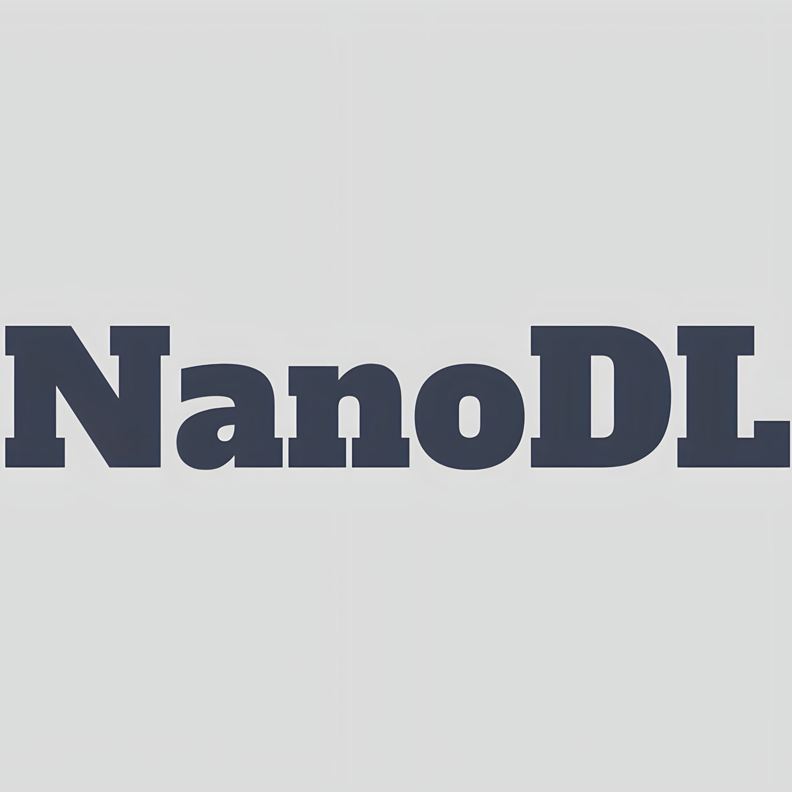

<p align="center">
  
</p>

# NanoDL: A Jax-based library for desinging and training transformer models.

 [](https://codecov.io/gh/google/nanodl)


[**Overview**](#overview)
| [**Quick install**](#quick-install)
| [**What does NanoDL look like?**](#what-does-nanodl-look-like)
| [**Documentation**](https://nan.readthedocs.io/)

This README is a very short intro. **To learn everything you need to know about nanodl, refer to our [full documentation](https://nanodl.readthedocs.io/).**

Nano Deep Learning (NanoDL) was built from helper functions written by [Henry Ndubuaku](https://www.linkedin.com/in/henry-ndubuaku-7b6350b8/) from 2022, and is now developed jointly with the open source community.

## Overview

Why NanoDL?
Building and training transformer-based models require significant time and resource commitment, yet AI/ML experts many times need to implement scratch versions of this at less scale for unique problems. Jax is a powerful, yet low-resource framework for developing much faster neural networks. Available resources for developing transformers do not fully support this framework and there are many dependencies between files in their source codes. NanoDL hosts various state-of-the-art models like LlaMa2, Mistral, Mixtral, GPT3, GPT4 (inferred), T5, Mixers, Diffusion, Whisper, ViT, Mixers, CLIP, GAT and vanilla Transformers. It also provide unique dataparallel distributed trainers for each, as well as various layers for custom model development such as RoPE, GQA, MQA, Relative Attention, Shifted Window Attention, patch embeddings, etc. All model files were written to be independent so developers can simply download/copy and run.

Furthermore, Scikit Learn is a powerful and immensley popular tool for developing classical ML models, but it still lacks GPU/TPU access by itself for high-load computations. NanoDL also provides GPU/TPU-accelerated models like PCA, KMeans, Gaussian Mixed Models, Linear/Logistic Regressions, Gaussian Processes, Naive Bayes etc., via Jax.NumPy(). 

Finally, NLP and Computer Vision problems often require auxillary algorithms for preprocessing and evaluation. NanoDL also provides these algorithms, including dataloaders. Pretrained weights are currently not provided as NanoDL was created for building from scratch, please refer to HuggingFace for such. 

Feedback on any of our discussion, issue and pull request threads are welcomed! Please report any feature requests, issues, questions or concerns in the [discussion forum](https://github.com/hmunachi/nanodl/discussions), or just let us know what you're working on! In case you want to reach out directly, we're at ndubuakuhenry@gmail.com.

## Quick install

You will need Python 3.6 or later, and working [JAX](https://github.com/google/jax/blob/main/README.md)
installation, [FLAX](https://github.com/google/flax/blob/main/README.md)
installation, [OPTAX](https://github.com/google-deepmind/optax/blob/main/README.md)
installation (with GPU support for running training, without can only support creations).
For a CPU-only version of JAX:

```
pip install --upgrade pip # To support manylinux2010 wheels.
pip install --upgrade jax jaxlib flax optax # CPU-only
```

Then, install nanodl from PyPi:

```
pip install nanodl
```

## What does nanodl look like?

We provide various examples using the nanodl API: language, vision and audio, starting with an LLM.

```py
import jax
import jax.numpy as jnp
from nanodl import ArrayDataset, DataLoader
from nanodl import GPT4, GPTDataParallelTrainer

# Generate dummy data
batch_size = 8
max_length = 51
data = jnp.ones((101, max_length), dtype=jnp.int32)

# Shift to create next-token prediction dataset
dummy_inputs = data[:, :-1]
dummy_targets = data[:, 1:]

# Create dataset and dataloader
dataset = ArrayDataset(dummy_inputs, dummy_targets)
dataloader = DataLoader(dataset, 
                        batch_size=batch_size, 
                        shuffle=True, 
                        drop_last=False)

# How to loop through dataloader
for batch in dataloader:
    x, y = batch
    print(x.shape, y.shape)

# model parameters
hyperparams = {
    'num_layers': 1,
    'hidden_dim': 256,
    'num_heads': 2,
    'feedforward_dim': 256,
    'dropout': 0.1,
    'vocab_size': 1000,
    'embed_dim': 256,
    'max_length': max_length,
    'start_token': 0,
    'end_token': 50,
}

# Initialize model
model = GPT4(**hyperparams)
rngs = {'params': jax.random.key(0), 'dropout': jax.random.key(1)}
params = model.init(rngs, dummy_inputs)['params']

# You call as you would a Jax/Flax model
outputs = model.apply(params, dummy_inputs, rngs)
print(outputs.shape)

# Training on data
trainer = GPTDataParallelTrainer(model, dummy_inputs.shape, 'params.pkl')
trainer.train(dataloader, num_epochs=2)
print(trainer.evaluate(dataloader))

# Generating from a start token
# Should always have dims (batch_size, seq_len)
# Use 'generate_batch' method for generating in batches
start_tokens = jnp.array([[123, 456]])

# Remember to load the trained parameter 
params = trainer.load_params('params.pkl')
outputs = model.apply({'params': params},
                      rngs={'dropout': jax.random.PRNGKey(2)}, 
                      method=model.generate)
print(output)
```
Vision example
```py
import jax
import jax.numpy as jnp
from nanodl import ArrayDataset, DataLoader
from nanodl import DiffusionModel, DiffusionDataParallelTrainer

image_size = 32
block_depth = 2
batch_size = 8
widths = [32, 64, 128]
key = jax.random.PRNGKey(0)
input_shape = (101, image_size, image_size, 3)
images = jax.random.normal(key, input_shape)

# Create dataset and dataloader
dataset = ArrayDataset(images) 
dataloader = DataLoader(dataset, 
                        batch_size=batch_size, 
                        shuffle=True, 
                        drop_last=False) 

# Create diffusion model
diffusion_model = DiffusionModel(image_size, widths, block_depth)
params = diffusion_model.init(key, images)
pred_noises, pred_images = diffusion_model.apply(params, images)
print(pred_noises.shape, pred_images.shape)

# Training on your data
# Note: saved params are often different from training weights, use the saved params for generation
trainer = DiffusionDataParallelTrainer(diffusion_model, images.shape, 'params.pkl')
trainer.train(dataloader, 10, dataloader)
print(trainer.evaluate(dataloader))

# Generate some samples
generated_images = diffusion_model.apply(params, 
                                         num_images=5, 
                                         diffusion_steps=5, 
                                         method=diffusion_model.generate)
print(generated_images.shape)
```

Audio Sample
```py
import jax
import jax.numpy as jnp
from nanodl import ArrayDataset, DataLoader
from nanodl import Whisper, WhisperDataParallelTrainer

# Dummy data parameters
batch_size = 8
max_length = 50
embed_dim = 256 
vocab_size = 1000 

# Generate data
dummy_targets = jnp.ones((101, max_length), dtype=jnp.int32)
dummy_inputs = jnp.ones((101, max_length, embed_dim))

# Create dataset and dataloader
dataset = ArrayDataset(dummy_inputs, dummy_targets)
dataloader = DataLoader(dataset, 
                        batch_size=batch_size, 
                        shuffle=True, 
                        drop_last=False)

# model parameters
hyperparams = {
    'num_layers': 1,
    'hidden_dim': 256,
    'num_heads': 2,
    'feedforward_dim': 256,
    'dropout': 0.1,
    'vocab_size': 1000,
    'embed_dim': embed_dim,
    'max_length': max_length,
    'start_token': 0,
    'end_token': 50,
}

# Initialize model
model = Whisper(**hyperparams)
rngs = {'params': jax.random.key(0), 'dropout': jax.random.key(1)}
params = model.init(rngs, dummy_inputs, dummy_targets)['params']
outputs = model.apply({'params': params}, dummy_inputs, dummy_targets, rngs=rngs)
print(outputs.shape)

# Training on your data
trainer = WhisperDataParallelTrainer(
  model, 
  dummy_inputs.shape,
  dummy_targets.shape, 
  'params.pkl'
  )
trainer.train(dataloader, 10, dataloader)
print(trainer.evaluate(dataloader))
```

PCA example
```py
from nanodl import PCA

data = jax.random.normal(jax.random.key(0), (1000, 10))
pca = PCA(n_components=2)
pca.fit(data)
transformed_data = pca.transform(data)
original_data = pca.inverse_transform(transformed_data)
X_sampled = pca.sample(n_samples=1000, key=None)
print(X_sampled.shape, original_data.shape, transformed_data.shape)
```

# Contribution

This is the first iteration of this project, roughness is expected, contributions are therefore highly encouraged! Feel free to fork the repository, create a branch, make your changes, and submit a pull request. Please ensure that your contributions align with the repository's design patterns. If you have a problem, please use the discussion section. Contributions can be made in the form of writing docs, fixing bugs, implementing papers, writing high-coverage tests, experimenting and submitting real-world examples to the examples section, reporting bugs, or responding to reported issues.

## Citing nanodl

To cite this repository:

```
@software{nanodl2020github,
  author = {{H}enry Ndubuaku},
  title = {{N}anoDL: A neural network library and ecosystem for {JAX}},
  url = {http://github.com/hmunachi/nanodl},
  version = {0.1.0},
  year = {2024},
}
```