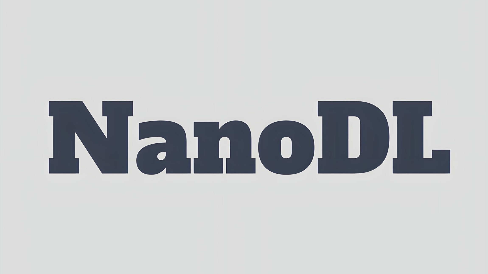

<p align="center">
  
</p>

# A Jax-based library for designing and training transformer models from scratch.

    [](https://www.linkedin.com//company/80434055) [](https://twitter.com/hmunachii)


[**Overview**](#overview)
| [**Quick install**](#quick-install)
| [**What does NanoDL look like?**](#what-does-nanodl-look-like)
| [**Documentation**](https://nan.readthedocs.io/)

Nano Deep Learning (NanoDL) was built from helper functions written by [Henry Ndubuaku](https://www.linkedin.com/in/henry-ndubuaku-7b6350b8/) since 2022, and is now developed jointly with the open source community.

## Overview

Developing and training transformer-based models is typically resource-intensive and time-consuming. AI/ML experts frequently need to build smaller-scale versions of these models for specific problems. Jax, a low-resource yet powerful framework, accelerates the development of neural networks, but existing resources for transformer development in Jax are limited. NanoDL addresses this challenge by offering a range of advanced models such as LlaMa2, Mistral, Mixtral, GPT3, GPT4 (inferred), T5, Mixers, Diffusion, Whisper, ViT, CLIP, GAT, and standard Transformers. 

NanoDL also provides unique data-parallel distributed trainers and various custom development layers like RoPE, GQA, MQA, Relative Attention, SWin attention, Patch Embedding and more. Importantly, all model files in NanoDL are independent, allowing developers to easily download/copy, and use them. These trainers are designed for single-node multi-device setup for now.

Additionally, while Scikit Learn is widely used for classical ML model development, it lacks native GPU/TPU support for intensive computations. NanoDL fills this gap by offering GPU/TPU-accelerated models such as PCA, KMeans, Gaussian Mixed Models, and others, using Jax.NumPy().

For NLP and Computer Vision applications, NanoDL provides essential auxiliary algorithms, including dataloaders, for preprocessing and evaluation. However, it's important to note that NanoDL is designed for building models from scratch for now, pretrained weights will be provided in the future. 

Feedback on any of our discussion, issue and pull request threads are welcomed! Please report any feature requests, issues, questions or concerns in the [discussion forum](https://github.com/hmunachi/nanodl/discussions), or just let us know what you're working on! In case you want to reach out directly, we're at ndubuakuhenry@gmail.com.

## Quick install

You will need Python 3.9 or later, and working [JAX](https://github.com/google/jax/blob/main/README.md)
installation, [FLAX](https://github.com/google/flax/blob/main/README.md)
installation, [OPTAX](https://github.com/google-deepmind/optax/blob/main/README.md)
installation (with GPU support for running training, without can only support creations).
Models can be designed and tested on CPUs but trainers are all Distributed Data-Parallel which would require a GPU with 1 to N GPUS/TPUS. For CPU-only version of JAX:

```
pip install --upgrade pip # To support manylinux2010 wheels.
pip install jax, flax, optax
```

Then, install nanodl from PyPi:

```
pip install nanodl
```

## What does nanodl look like?

We provide various examples using the nanodl API: language, vision and audio, starting with an LLM.

```py
import jax
import jax.numpy as jnp
from nanodl import ArrayDataset, DataLoader
from nanodl import GPT4, GPTDataParallelTrainer

# Generate dummy data
batch_size = 8
max_length = 10

# Replace with actual tokenised data
data = jnp.ones((101, max_length), dtype=jnp.int32)

# Shift to create next-token prediction dataset
dummy_inputs = data[:, :-1]
dummy_targets = data[:, 1:]

# Create dataset and dataloader
dataset = ArrayDataset(dummy_inputs, dummy_targets)
dataloader = DataLoader(dataset, 
                        batch_size=batch_size, 
                        shuffle=True, 
                        drop_last=False)

# How to loop through dataloader
for batch in dataloader:
    x, y = batch
    print(x.shape, y.shape)
    break

# model parameters
hyperparams = {
    'num_layers': 1,
    'hidden_dim': 256,
    'num_heads': 2,
    'feedforward_dim': 256,
    'dropout': 0.1,
    'vocab_size': 1000,
    'embed_dim': 256,
    'max_length': max_length,
    'start_token': 0,
    'end_token': 50,
}

# Initialize model
model = GPT4(**hyperparams)
rngs = jax.random.PRNGKey(0)
rngs, dropout_rng = jax.random.split(rngs)
params = model.init({'params': rngs, 'dropout': dropout_rng}, dummy_inputs)['params']

# Call as you would a Jax/Flax model
outputs = model.apply({'params': params}, 
                      dummy_inputs, 
                      rngs={'dropout': dropout_rng})
print(outputs.shape)

# Training on data
trainer = GPTDataParallelTrainer(model, dummy_inputs.shape, 'params.pkl')
trainer.train(train_loader=dataloader, 
              num_epochs=2, 
              val_loader=dataloader)

print(trainer.evaluate(dataloader))

# Generating from a start token
start_tokens = jnp.array([[123, 456]])

# Remember to load the trained parameters 
params = trainer.load_params('params.pkl')
outputs = model.apply({'params': params},
                      start_tokens,
                      rngs={'dropout': jax.random.PRNGKey(2)}, 
                      method=model.generate)
print(outputs) 
```
Vision example
```py
import jax
import jax.numpy as jnp
from nanodl import ArrayDataset, DataLoader
from nanodl import DiffusionModel, DiffusionDataParallelTrainer

image_size = 32
block_depth = 2
batch_size = 8
widths = [32, 64, 128]
key = jax.random.PRNGKey(0)
input_shape = (101, image_size, image_size, 3)
images = jax.random.normal(key, input_shape)

# Use your own images
dataset = ArrayDataset(images) 
dataloader = DataLoader(dataset, 
                        batch_size=batch_size, 
                        shuffle=True, 
                        drop_last=False) 

# Create diffusion model
diffusion_model = DiffusionModel(image_size, widths, block_depth)
params = diffusion_model.init(key, images)
pred_noises, pred_images = diffusion_model.apply(params, images)
print(pred_noises.shape, pred_images.shape)

# Training on your data
# Note: saved params are often different from training weights, use the saved params for generation
trainer = DiffusionDataParallelTrainer(diffusion_model, 
                                       input_shape=images.shape, 
                                       weights_filename='params.pkl', 
                                       learning_rate=1e-4)
trainer.train(dataloader, 10, dataloader)
print(trainer.evaluate(dataloader))

# Generate some samples
params = trainer.load_params('params.pkl')
generated_images = diffusion_model.apply({'params': params}, 
                                         num_images=5, 
                                         diffusion_steps=5, 
                                         method=diffusion_model.generate)
print(generated_images.shape)
```

Audio example
```py
import jax
import jax.numpy as jnp
from nanodl import ArrayDataset, DataLoader
from nanodl import Whisper, WhisperDataParallelTrainer

# Dummy data parameters
batch_size = 8
max_length = 50
embed_dim = 256 
vocab_size = 1000 

# Generate data: replace with actual tokenised/quantised data
dummy_targets = jnp.ones((101, max_length), dtype=jnp.int32)
dummy_inputs = jnp.ones((101, max_length, embed_dim))

dataset = ArrayDataset(dummy_inputs, 
                       dummy_targets)

dataloader = DataLoader(dataset, 
                        batch_size=batch_size, 
                        shuffle=True, 
                        drop_last=False)

# How to loop through dataloader
for batch in dataloader:
    x, y = batch
    print(x.shape, y.shape)
    break

# model parameters
hyperparams = {
    'num_layers': 1,
    'hidden_dim': 256,
    'num_heads': 2,
    'feedforward_dim': 256,
    'dropout': 0.1,
    'vocab_size': 1000,
    'embed_dim': embed_dim,
    'max_length': max_length,
    'start_token': 0,
    'end_token': 50,
}

# Initialize model
model = Whisper(**hyperparams)
rngs = {'params': jax.random.key(0), 'dropout': jax.random.key(1)}
params = model.init(rngs, dummy_inputs, dummy_targets)['params']
outputs = model.apply({'params': params}, dummy_inputs, dummy_targets, rngs=rngs)
print(outputs.shape)

# Training on your data
trainer = WhisperDataParallelTrainer(model, 
                                     dummy_inputs.shape, 
                                     dummy_targets.shape, 
                                     'params.pkl')
trainer.train(dataloader, 2, dataloader)

# Sample inference
params = trainer.load_params('params.pkl')

# for more than one sample, use model.generate_batch
transcripts = model.apply({'params': params}, 
                          dummy_inputs[:1], 
                          rngs=rngs, 
                          method=model.generate)

print(transcripts)
```

PCA example
```py
import jax
from nanodl import PCA

data = jax.random.normal(jax.random.key(0), (1000, 10))
pca = PCA(n_components=2)
pca.fit(data)
transformed_data = pca.transform(data)
original_data = pca.inverse_transform(transformed_data)
X_sampled = pca.sample(n_samples=1000, key=None)
print(X_sampled.shape, original_data.shape, transformed_data.shape)
```

# Contribution

This is the first iteration of this project, roughness is expected, contributions are therefore highly encouraged! Follow the recommended steps:

- Raise the issue/discussion to get second opinions
- Fork the repository
- Create a branch
- Make your changes without ruining the design patterns
- Write tests for your changes if necessary
- Install locally with `pip install -e .`
- Run tests with `python -m unittest discover -s tests`
- Then submit a pull request from branch.

Contributions can be made in various forms:

- Writing documentation.
- Fixing bugs.
- Implementing papers.
- Writing high-coverage tests.
- OPtimizing existing codes.
- Experimenting and submitting real-world examples to the examples section.
- Reporting bugs.
- Responding to reported issues.

Coming features include:
- Reinforcement Learning With Human Feedback (RLHF).
- Tokenizers.
- Code optimisations.

To follow up or share thoughts, follow [here](https://forms.gle/vwveb9SKdPYywHx9A)

## Sponsorships

The name "NanoDL" stands for Nano Deep Learning. Models are exploding in size, therefore gate-keeping 
experts and companies with limited resources from building flexible models without prohibitive costs.
Following the success of Phi models, the long-term goal is to build and train nano versions of all available models,
while ensuring they compete with the original models in performance, with total 
number of parameters not exceeding 1B. Trained weights will be made available via this library.
Any form of sponsorship, funding, grants or contribution will help with training resources.
You can sponsor via the tag on the user profile, or reach out via ndubuakuhenry@gmail.com.

## Citing nanodl

To cite this repository:

```
@software{nanodl2024github,
  author = {Henry Ndubuaku},
  title = {NanoDL: A Jax-based library for designing and training transformer models from scratch.},
  url = {http://github.com/hmunachi/nanodl},
  version = {0.1.0},
  year = {2024},
}
```
